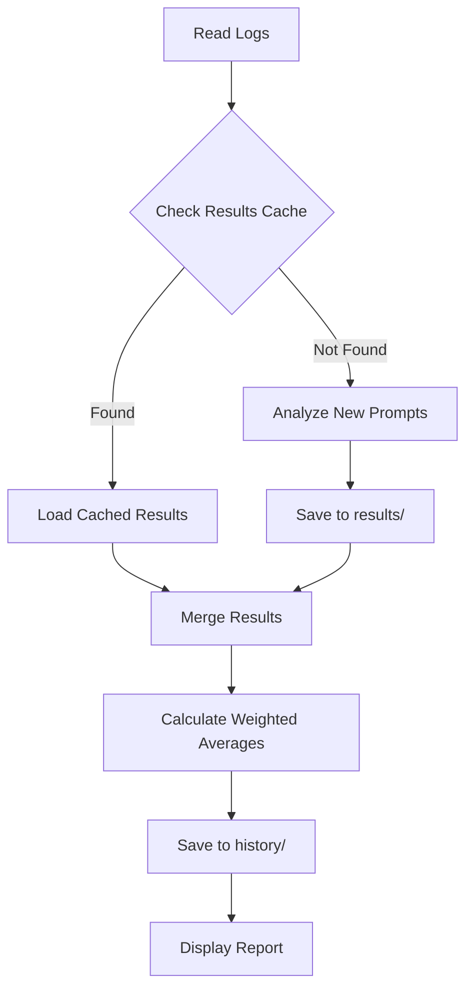

# Performance Optimization - Incremental Results Storage

## Overview

This plan implements an incremental result storage system that:

- Stores individual prompt analysis results in `~/.hyntx/results/` to avoid reprocessing
- Uses weighted averages when merging new results with existing cached results
- Optimizes the analysis flow to only process new prompts
- Enhances watch mode to save results incrementally

## Architecture Changes

### New Directory Structure

```text
~/.hyntx/
├── history/              # Existing: Daily aggregated results
└── results/              # NEW: Individual prompt results
    └── <YYYY-MM-DD>/     # Grouped by date for efficient cleanup
        └── <hash>.json

~/.hyntx-cache/           # Existing (unchanged)
└── analysis/             # Batch-level cache
```

**Benefits of date-based organization:**

- Efficient cleanup by date range (just delete folders)
- No index file needed (use filesystem globs)
- Clear separation from batch cache

### Data Flow



## Implementation Tasks

### 1. Create Results Storage Module (`src/core/results-storage.ts`)

**Purpose**: Manage individual prompt result storage and retrieval.

**Key Functions**:

```typescript
// Generate unique hash including all invalidation factors
function getPromptResultHash(
  prompt: string,
  date: string,
  project: string | undefined,
  model: string,
  schemaType: string,
): string;

// Load cached result with system prompt validation
function getPromptResult(
  hash: string,
  date: string,
): Promise<PromptResult | null>;

// Save result atomically (temp file + rename)
function savePromptResult(result: PromptResult): Promise<void>;

// Batch load for efficiency - returns cached + prompts to analyze
function getPromptsWithCache(
  prompts: ExtractedPrompt[],
  model: string,
  schemaType: string,
): Promise<{
  cached: Map<string, AnalysisResult>;
  toAnalyze: ExtractedPrompt[];
}>;

// Manual cleanup by date (no TTL - uses systemPromptHash for invalidation)
function cleanupResults(beforeDate: string): Promise<number>;
```

**Storage Format**:

```typescript
type PromptResultMetadata = {
  readonly promptHash: string;
  readonly prompt: string; // Truncated/sanitized for reference
  readonly date: string;
  readonly project?: string;
  readonly analyzedAt: number; // Unix timestamp
  readonly provider: string;
  readonly model: string;
  readonly schemaType: string; // 'full' | 'minimal'
  readonly systemPromptHash: string; // For automatic invalidation
};

type PromptResult = {
  readonly result: AnalysisResult;
  readonly metadata: PromptResultMetadata;
};
```

**File Structure**: `~/.hyntx/results/<YYYY-MM-DD>/<hash>.json`

### 2. Enhance Analyzer with Incremental Processing (`src/core/analyzer.ts`)

**Changes**:

- Add `getIncrementalAnalysisOptions()` function to identify which prompts need analysis
- Modify `analyzePrompts()` to accept optional `existingResults: Map<string, AnalysisResult>`
- Update merge logic to use weighted averages when combining cached + new results

**Weighted Average Calculation**:

```typescript
// For scores: weighted by prompt count
const totalPrompts = existingPrompts + newPrompts;
const weightedScore =
  (existingScore * existingPrompts + newScore * newPrompts) / totalPrompts;

// For pattern frequencies: sum frequencies, then recalculate
const mergedFrequency = existingFrequency + newFrequency;

// For pattern severity: use max severity (most conservative)
const mergedSeverity = maxSeverity([existingSeverity, newSeverity]);
```

### 3. Update CLI to Use Incremental Storage (`src/cli.ts`)

**Changes in `analyzeWithProgress()`**:

1. Before analysis: Load cached results for all prompts
2. Filter out prompts that already have cached results
3. Only analyze new prompts
4. Merge cached + new results using weighted averages
5. Save new results to `~/.hyntx/results/`

**New Helper Function**:

```typescript
async function loadAndFilterCachedResults(
  prompts: ExtractedPrompt[],
  noCache: boolean,
): Promise<{
  cached: Map<string, AnalysisResult>;
  toAnalyze: ExtractedPrompt[];
}>;
```

### 4. Enhance Watch Mode (`src/cli.ts` - `runWatchMode()`)

Watch mode already processes prompts individually. Integration is straightforward:

**Changes in event handler:**

```typescript
// In 'prompt' event handler
watcher.on('prompt', async (prompt: ExtractedPrompt) => {
  const hash = getPromptResultHash(
    prompt.content,
    prompt.date,
    prompt.project,
    model,
    schemaType
  );

  // 1. Check results cache first (before LRU check)
  const cached = await getPromptResult(hash, prompt.date);
  if (cached) {
    displayCachedResult(cached); // Show without re-analyzing
    return;
  }

  // 2. Existing LRU check for same-session duplicates
  const key = `${prompt.project}:${prompt.sessionId}:${prompt.timestamp}`;
  if (analyzedPrompts.has(key)) return;
  analyzedPrompts.set(key, Date.now());

  // 3. Analyze the prompt
  const result = await analyzePrompts(provider, [prompt.content], prompt.date, ...);

  // 4. Save to results cache immediately
  await savePromptResult({
    result,
    metadata: {
      promptHash: hash,
      prompt: prompt.content.slice(0, 500), // Truncate for reference
      date: prompt.date,
      project: prompt.project,
      analyzedAt: Date.now(),
      provider: provider.name,
      model,
      schemaType,
      systemPromptHash: hashSystemPrompt(),
    },
  });

  // 5. Display result (existing logic)
  displayResult(result);
});
```

**Benefits:**

- Cross-session duplicate detection (not just same-session LRU)
- Results persisted for future runs
- No reprocessing when restarting watch mode

### 5. Add Results Storage Paths (`src/utils/paths.ts`)

**New Constants**:

```typescript
export const HYNTX_RESULTS_DIR =
  process.env['HYNTX_RESULTS_DIR'] ?? join(HOME, '.hyntx', 'results');

// Helper to get date-specific results folder
export function getResultsDateDir(date: string): string {
  return join(HYNTX_RESULTS_DIR, date); // e.g., ~/.hyntx/results/2024-01-15/
}
```

### 6. Update Types (`src/types/index.ts`)

**New Types** (export from main entry point):

```typescript
export type PromptResultMetadata = {
  readonly promptHash: string;
  readonly prompt: string; // Truncated/sanitized
  readonly date: string;
  readonly project?: string;
  readonly analyzedAt: number; // Unix timestamp
  readonly provider: string;
  readonly model: string;
  readonly schemaType: string; // 'full' | 'minimal'
  readonly systemPromptHash: string; // For invalidation
};

export type PromptResult = {
  readonly result: AnalysisResult;
  readonly metadata: PromptResultMetadata;
};
```

**Note**: No `ResultsIndex` type needed - use filesystem globs for lookups.

## Implementation Details

### Hash Generation Strategy

Use SHA-256 hash of all factors that affect analysis results:

```typescript
// Consistent with existing batch cache key strategy
function getPromptResultHash(
  prompt: string,
  date: string,
  project: string | undefined,
  model: string,
  schemaType: string,
): string {
  // Use null byte separator to avoid collisions
  const input = [prompt, date, project ?? '', model, schemaType].join('\x00');
  return hashString(input); // Reuse from analysis-cache.ts
}
```

**Why include all these fields:**

- `prompt`: The actual content being analyzed
- `date`: Same prompt on different dates may have different context
- `project`: Same prompt in different projects may need different analysis
- `model`: Different models produce different results
- `schemaType`: 'full' vs 'minimal' return different structures

### Weighted Average Merge Logic

When merging cached results with new results:

```typescript
function mergeWithCached(
  cached: Map<string, AnalysisResult>,
  newResults: AnalysisResult[],
): AnalysisResult {
  const allResults = [...cached.values(), ...newResults];

  // 1. Merge patterns (reuse existing mergeBatchResults logic)
  const mergedPatterns = mergePatterns(allResults);

  // 2. Merge stats
  const stats = mergeStats(allResults);

  // 3. Select top suggestion from highest severity pattern
  const topSuggestion = selectTopSuggestion(mergedPatterns);

  return { date: 'today', patterns: mergedPatterns, stats, topSuggestion };
}
```

**Detailed merge rules:**

1. **Overall Score**: Weighted average by prompt count

   ```typescript
   const totalPrompts = sum(results.map((r) => r.stats.totalPrompts));
   const weightedScore =
     sum(results.map((r) => r.stats.overallScore * r.stats.totalPrompts)) /
     totalPrompts;
   ```

2. **Prompts With Issues**: Sum (each represents individual prompt counts)

   ```typescript
   const promptsWithIssues = sum(results.map((r) => r.stats.promptsWithIssues));
   ```

3. **Total Prompts**: Sum counts

   ```typescript
   const totalPrompts = sum(results.map((r) => r.stats.totalPrompts));
   ```

4. **Pattern Frequencies**: Sum frequencies (they represent counts)

   ```typescript
   const mergedFrequency = existingPattern.frequency + newPattern.frequency;
   ```

5. **Pattern Severity**: Use maximum severity (most conservative)

   ```typescript
   const mergedSeverity = maxSeverity([
     existingPattern.severity,
     newPattern.severity,
   ]);
   ```

6. **Pattern Examples**: Deduplicate and limit to 3

   ```typescript
   const mergedExamples = [
     ...new Set([...existing.examples, ...new.examples]),
   ].slice(0, 3);
   ```

7. **Top Suggestion**: From pattern with highest severity, then highest frequency

   ```typescript
   const topPattern = mergedPatterns.sort(
     (a, b) =>
       severityOrder[b.severity] - severityOrder[a.severity] ||
       b.frequency - a.frequency,
   )[0];
   const topSuggestion = topPattern?.suggestion ?? '';
   ```

### Cache Invalidation

Results use **system prompt hash validation** instead of TTL:

```typescript
async function getPromptResult(
  hash: string,
  date: string,
): Promise<PromptResult | null> {
  const filePath = join(getResultsDateDir(date), `${hash}.json`);

  try {
    const cached = JSON.parse(await readFile(filePath, 'utf8')) as PromptResult;

    // Validate system prompt hasn't changed (analysis logic may be different)
    const currentHash = hashSystemPrompt();
    if (cached.metadata.systemPromptHash !== currentHash) {
      await unlink(filePath); // Remove stale result
      return null;
    }

    return cached;
  } catch {
    return null;
  }
}
```

**Why no TTL:**

- Prompts are historical (content never changes)
- `systemPromptHash` automatically invalidates when analysis logic changes
- Manual cleanup available via `cleanupResults(beforeDate)` if needed
- Reduces unnecessary reprocessing of old prompts

**Invalidation triggers:**

- System prompt changes → `systemPromptHash` mismatch → result discarded
- Model/schemaType changes → different hash → cache miss (different file)
- Manual cleanup → user runs cleanup command

### Performance Benefits

1. **First Run**: No change (all prompts analyzed)
2. **Subsequent Runs**: Only new prompts analyzed, cached results loaded instantly
3. **Watch Mode**: Results saved incrementally, no reprocessing
4. **Large Date Ranges**: Significant speedup when most prompts are cached

## Files to Modify

| File                          | Change Type | Description                                               |
| ----------------------------- | ----------- | --------------------------------------------------------- |
| `src/utils/paths.ts`          | Modify      | Add `HYNTX_RESULTS_DIR` and `getResultsDateDir()`         |
| `src/types/index.ts`          | Modify      | Add `PromptResult`, `PromptResultMetadata` types          |
| `src/core/results-storage.ts` | **NEW**     | Results storage module with all cache operations          |
| `src/core/analyzer.ts`        | Modify      | Integrate `getPromptsWithCache()` before batch processing |
| `src/cli.ts`                  | Modify      | Update `analyzeWithProgress()` and `runWatchMode()`       |
| `src/cache/analysis-cache.ts` | Modify      | Export `hashString` and `hashSystemPrompt` for reuse      |

**Note**: No separate `merge-results.ts` needed - reuse existing `mergeBatchResults()` logic from analyzer.

## Testing Strategy

### Unit Tests (`src/core/results-storage.test.ts`)

```typescript
describe('results-storage', () => {
  describe('getPromptResultHash', () => {
    it('should generate deterministic hashes');
    it('should produce different hashes for different models');
    it('should produce different hashes for different schemaTypes');
    it('should handle undefined project');
  });

  describe('savePromptResult / getPromptResult', () => {
    it('should round-trip result correctly');
    it('should create date directory if missing');
    it('should return null for missing file');
    it('should invalidate on systemPromptHash mismatch');
    it('should delete stale results on invalidation');
  });

  describe('getPromptsWithCache', () => {
    it('should return all prompts as toAnalyze when cache empty');
    it('should return cached results and filter toAnalyze');
    it('should handle mixed cache hits/misses');
  });

  describe('cleanupResults', () => {
    it('should remove results before specified date');
    it('should preserve results after specified date');
    it('should return count of removed files');
  });
});
```

### Integration Tests

```typescript
describe('incremental analysis flow', () => {
  it('should use cache on second run with same prompts');
  it('should analyze only new prompts on mixed runs');
  it('should merge cached + new results correctly');
  it('should respect --no-cache flag');
});

describe('watch mode incremental', () => {
  it('should save result after analyzing new prompt');
  it('should skip analysis for cached prompts');
  it('should display cached results');
});
```

### Performance Tests

```typescript
describe('performance', () => {
  it('should load 100 cached results in < 500ms');
  it('should handle 1000+ result files without degradation');
  it('should use < 50MB memory for 1000 cached results');
});
```

## Migration Strategy

- No migration needed: New system works alongside existing cache
- Old cache entries remain valid
- Results storage is additive (doesn't break existing functionality)

## Configuration

**Environment variable:**

- `HYNTX_RESULTS_DIR`: Override results directory (default: `~/.hyntx/results`)

**CLI flags:**

- `--no-cache`: Disables both batch cache and results cache (unified flag)
- `--clear-results`: Clear all results cache (future enhancement)

## Future Enhancements (Out of Scope)

- Background daemon for continuous processing
- Database backend for large-scale deployments
- Result compression for disk space optimization

## Final Design Decisions

The following decisions resolve the technical concerns identified during review:

### Decision 1: Include `systemPromptHash` in File Hash

**Problem**: Orphaned files when system prompt changes.

**Solution**: Include `systemPromptHash` in the hash calculation:

```typescript
function getPromptResultHash(
  prompt: string,
  date: string,
  project: string | undefined,
  model: string,
  schemaType: string,
  systemPromptHash: string, // Added parameter
): string {
  const input = [
    prompt,
    date,
    project ?? '',
    model,
    schemaType,
    systemPromptHash,
  ].join('\x00');
  return hashString(input);
}
```

**Rationale**: When the system prompt changes, new files are created with different hashes. Old files are cleaned up via `cleanupResults(beforeDate)`. This eliminates read-time validation complexity and orphaned file accumulation.

### Decision 2: Accept Duplicate Work in Race Conditions

**Problem**: Multiple watch mode instances may analyze the same prompt simultaneously.

**Solution**: Accept duplicate analysis as an acceptable trade-off.

**Rationale**:

- File locking adds significant complexity (`proper-lockfile` dependency, deadlock handling)
- Atomic writes (temp + rename) prevent data corruption
- Duplicate analysis is rare in practice (same prompt, same second, different process)
- Cost of occasional duplicate analysis << cost of lock management

### Decision 3: Reuse `mergeBatchResults()` Function

**Problem**: Proposed new merge functions duplicate existing logic.

**Solution**: Export and reuse `mergeBatchResults()` from analyzer:

```typescript
// In src/core/analyzer.ts - export existing function
export function mergeBatchResults(results: AnalysisResult[]): AnalysisResult;

// In results-storage.ts or cli.ts
import { mergeBatchResults } from './analyzer';
const merged = mergeBatchResults([...cached.values(), ...newResults]);
```

**Rationale**: Single source of truth for merge logic. No new `mergeWithCached()`, `mergePatterns()`, or `mergeStats()` functions needed.

### Decision 4: Remove Truncated Prompt from Metadata

**Problem**: Storing `prompt.content.slice(0, 500)` accumulates ~1MB per 1000 prompts.

**Solution**: Remove `prompt` field from `PromptResultMetadata`:

```typescript
type PromptResultMetadata = {
  readonly promptHash: string;
  // readonly prompt: string;  // REMOVED - hash is sufficient
  readonly date: string;
  readonly project?: string;
  readonly analyzedAt: number;
  readonly provider: string;
  readonly model: string;
  readonly schemaType: string;
  // readonly systemPromptHash: string;  // REMOVED - included in file hash
};
```

**Rationale**: The hash uniquely identifies the prompt. If debugging is needed, the original prompt exists in Claude logs. This reduces storage by ~50%.

### Decision 5: Add Performance Logging

**Problem**: No metrics to validate effectiveness post-implementation.

**Solution**: Add logging to measure cache effectiveness:

```typescript
// Log on each analysis run
logger.debug('Results cache', {
  cached: cached.size,
  toAnalyze: toAnalyze.length,
  cacheHitRate: cached.size / (cached.size + toAnalyze.length),
});
```

**Rationale**: Gather metrics during real usage rather than blocking implementation. If cache hit rate is low, we can adjust the strategy.

## Updated Implementation Summary

With these decisions, the implementation is simplified:

| Change                         | Original Plan         | Final Decision              |
| ------------------------------ | --------------------- | --------------------------- |
| Hash includes systemPromptHash | No (validate at read) | Yes (in hash)               |
| Race condition handling        | Consider file locking | Accept duplicates           |
| Merge functions                | New functions         | Reuse existing              |
| Metadata stores prompt         | Yes (truncated)       | No                          |
| Pre-implementation metrics     | Required              | Post-implementation logging |

## Implementation Ready

This plan is approved for implementation. Start with:

1. `src/utils/paths.ts` - Add results directory constants
2. `src/types/index.ts` - Add simplified types
3. `src/core/results-storage.ts` - New module with decided approach
4. `src/core/analyzer.ts` - Export `mergeBatchResults()`, integrate cache
5. `src/cli.ts` - Update analysis flow and watch mode
